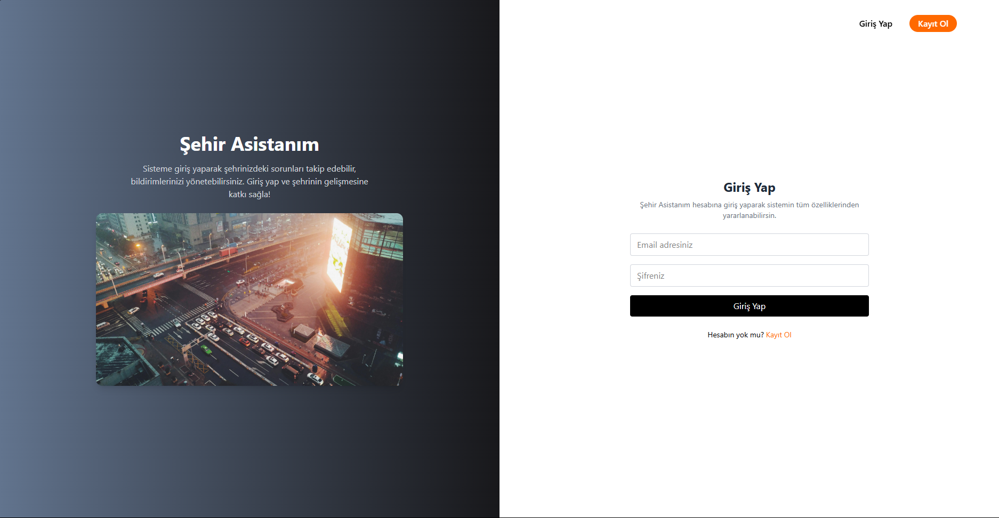
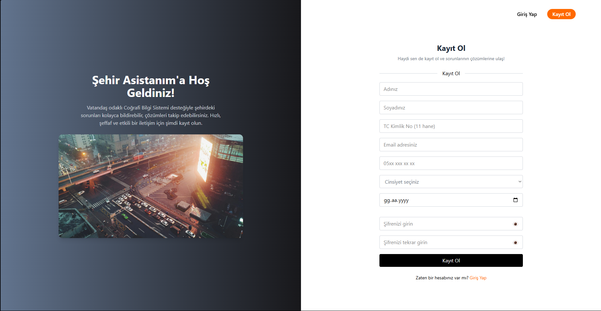
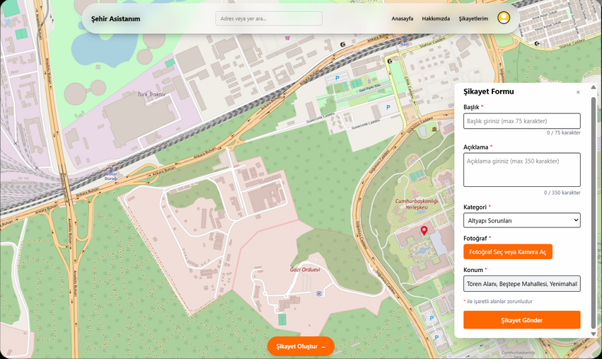
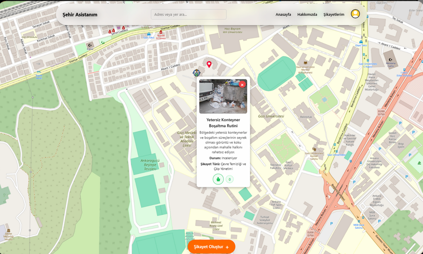
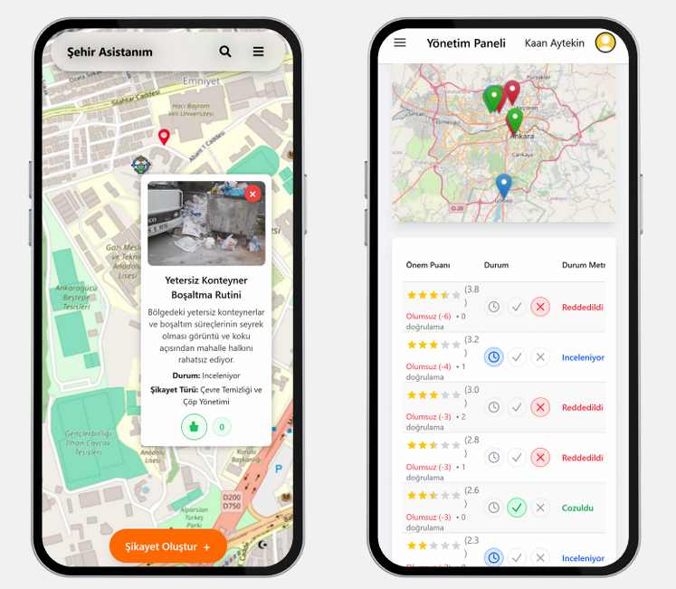
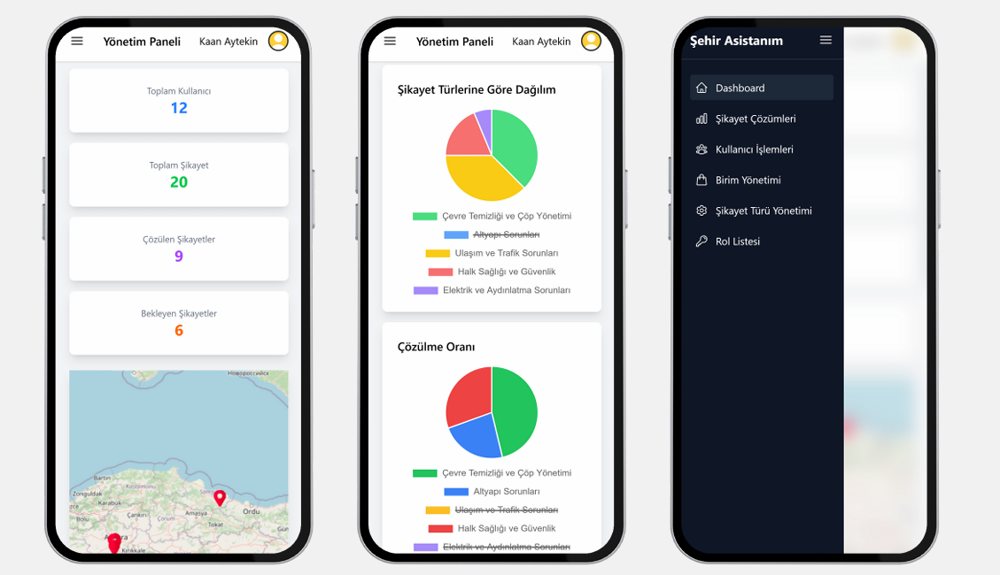

# Şehir Asistanım - Dijital Belediye Talep ve Şikayet Platformu

## Geliştirme Ekibi
- Elif Eryıldırım  
- Umut Güven Uslu  
- Fatma Buse Özmen  

## Proje Tanımı
Vatandaş-belediye etkileşimini dijitalleştiren harita tabanlı şikayet ve talep platformu. Geleneksel bildirim kanallarının aksine:

- Konumsal veriye dayalı
- Şeffaf ve takip edilebilir
- Çok katmanlı şikayet yönetimi

## Hedefler
### Kısa Vadeli
- Harita tabanlı bildirim sistemi
- Dijital sorun takibi
- SMS/E-posta bildirimleri

### Uzun Vadeli
- STK ve kriz yönetim entegrasyonu
- Veri analitiği ile aksiyon planlama

## Teknik Altyapı
- **Harita Servisi**: OpenLayers, GeoJSON  
- **Frontend**: React  
- **Backend**: ASP.NET Core WEB API  
- **Veritabanı**: PostgreSQL + PostGIS  
- **Güvenlik**: JWT token  

## Kullanıcı Profilleri
- Vatandaşlar  
- Belediye Birimleri  
- Birim Amiri  

## Katma Değerler
- Operasyonel verimlilik  
- Vatandaş katılımında artış  
- Zaman ve maliyet tasarrufu  

## Yenilikçi Yönler
- Harita üzerinden direkt bildirim  
- Topluluk oylaması ile önceliklendirme  
- Çok katmanlı şikayet yönetimi  

## Gelecek Planları
- Mobil uygulama dönüşümü  
- Veri analiz raporları  
- AFAD ve STK entegrasyonu  

## Ekran Görüntüleri
#### Giriş Ekranı

#### Kayıt Ekranı

#### Ana Sayfa

#### Şikayet Görüntüsü

#### Mobil Görüntüleri

